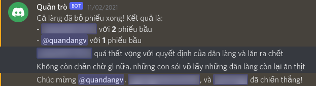

# wolfmod
Chatbot tự động quản trò Ma Sói

## cài đặt phần mềm

Cài [Python](https://www.python.org/downloads) và [pip](https://pip.pypa.io/en/stable/cli/pip_install) phiên bản mới nhất, nếu dùng Windows thì nhớ thêm Python vào biến PATH.

Sau đó, chạy lệnh `pip install -r requirements.txt`.

## setup trên Discord

- [Bật chế độ Developer Mode](https://support.discord.com/hc/en-us/articles/206346498-Where-can-I-find-my-User-Server-Message-ID-) trong User Setting

- [Tạo một con bot](https://discordpy.readthedocs.io/en/stable/discord.html) ở Developer Portal của Discord

- [Mời con bot vào server của mình](https://discordpy.readthedocs.io/en/stable/discord.html#inviting-your-bot). Sau đó vào mục Bot và sao chép Token của con bot

## setup con bot
Cài [Python](https://www.python.org/downloads) phiên bản mới nhất. Đối với máy máy Windows, nhớ kiểm tra đã thêm Python vào biến PATH.

Sau đó tải hoặc clone repo này, đổi tên `server_conf.example.py` thành `server_conf.py` và điền thông tin vào tất cả các biến:
- `TOKEN` điền token của con bot vừa copy
- `GAME_CHANNEL` lấy ID của kênh trò chuyện chính trong game bằng cách click chuột phải và sao chép ID của kênh
- `DEBUG_CHANNEL` tạo một kênh debug để bot báo lỗi
- `ADMINS` thêm UserID của chính mình để làm admin
- `LANGUAGE` điền là vn để dùng tiếng Việt

Cuối cùng, bạn có thể chạy `python bot.py` để chạy chatbot của mình
