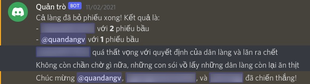

# wolfmod
Chatbot moderator for Werewolf game

## installation

Install the latest version of [Python](https://www.python.org/downloads) and [pip](https://pip.pypa.io/en/stable/cli/pip_install), if using Windows, remember to add Python to PATH.

Install the prerequisites using `pip install -r requirements.txt`.

## setup trên Discord

- [Enable Developer Mode in Discord](https://support.discord.com/hc/en-us/articles/206346498-Where-can-I-find-my-User-Server-Message-ID-) from User Setting

- [Create a bot](https://discordpy.readthedocs.io/en/stable/discord.html) in the Developer Portal

- [Invite your bot to your server](https://discordpy.readthedocs.io/en/stable/discord.html#inviting-your-bot). After that, find and copy your bot's token

## setup the chatbot

After cloning this repo, rename `server_conf.example.py` to `server_conf.py` and fill your info to all the variables in it:
- `TOKEN` the bot's token you copied
- `GAME_CHANNEL` take the ID of your game channel by right clicking and copy the channel ID
- `DEBUG_CHANNEL` the ID of a debug channel to send error messages
- `ADMINS` put your own user ID to become an admin
- `LANGUAGE` put `en` for English

After this, you can run `python bot.py` to run your chatbot.
